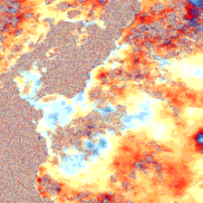
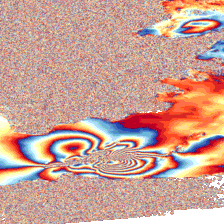
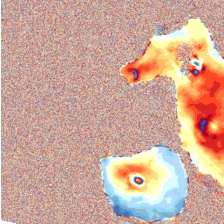
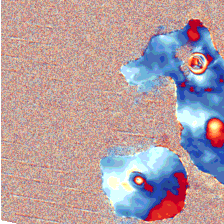
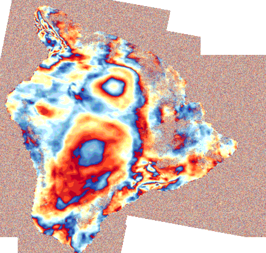

Free satellite data have revolutionized the way we observe the earth. The Sentinel missions consistently capture and provide satellite data from all around the globe.
Since the data are raw, it is up to us to extract meaningful information. In this blog post, we explore the potential 
hidden in Sentinel-1 data a.k.a Synthetic Aperture Radar. SAR can provide us with high temporal and spatial resolution images (20 meters per pixel every 6 days for the whole globe).
In our use case, however, we focus on interferometric SAR. This technique uses two SAR images from the same area to create ground deformation maps. This method can highlight changes on the ground 
in the range of a few centimetres. Typical examples can be seen in the following figures: 

 

On the left, we see a normal InSAR patch with no ground deformation between the first and the second SAR image. On the right, however, we can see multiple deformation fringes indicating a large scale event that caused changes on the ground between the caption of the two SAR images.
In fact, this event is attributed to the recent volcanic eruption of the Fagradalsfjall volcano in Iceland.
The background noise is caused by the existence of water.
#### Why do we care about Ground Deformation?

Since we can see centimetre changes on the ground, InSAR can help us study and monitor earthquakes, volcanoes, glaciers etc.
In the particular case of volcanoes, ground deformation has been statistically linked with eruption[1]. However, volcanic activity is not an instantaneous event.
Usually, its activity starts way before the eruption and this activity can be detected via ground deformation. It is clear that the earlier the warnings the fewer the casualties.

#### Volcanic Unrest Detection

Due to complex underground mechanisms, it is non-trivial (and in fact, unknown) how to predict volcanic eruption. However, given the vast amount of SAR images we should be able to detect any kind of unrest episode early on.
Obviously, an unrest episode as shown earlier does not need any kind of monitoring to be observed. The volcano has already erupted and there is nothing we can do about it. Our interest lies in creating a method to detect
the early stages of volcanic unrest phase in a global scale. We can generate InSAR for the whole globe. What we lack is a clear method that can detect the deformation and generalize to all different atmospheric and topological variabities.
One would expect that most volcanoes would be pretty far from civilization. However, recent eruptions in Congo, La Palma and others has reminded us that people still live near active volcanoes. In fact, according to [2] more than  800  million  people  live  within  100km  from  an  active volcano while 29 million within 10km.
    
##### How does Volcanic activity look like early on?
The following two figures show small ground deformation in the area of Cerro Azul.

  
 
At the same time we have to address the atmospheric disturbances that cause fringes similar to ground deformation.
A good example can be seen below:

#### What has been done?

Recent approaches e.g [3] and [4] have attempted to utilize standard Convolutional Neural Networks (CNN) motivated by their success in multiple domains such as biology[5], medicine[6] etc. Assuming large enough curated datasets
this approach could work. Given that there is a naturally occurringclass imbalance (volcanoes are typically found in a resting phase) and that the labelling process is really expensive (requires an expert to spend a great amount of time) researchers were forced to look for alternative ways to train their models. To this end, the research community exploited pre-trained CNNs from optical tasks, hoping that finetuning them on the task at hand would be enough to learn from their minimal datasets. A second approach was to use synthetically generated InSAR data for training.
This approach failed initially due to the distribution shift and in particular the covariance shift. 

#### What else can be done?

Two approaches proved to be able to circumvent the aforementioned issues. The first[7] rely on the exploitation of the massive, freely available satellite data (e.g from Sentinel missions) 
without the use of any human supervision. This approach is motivated by the recent advances of self-supervised learning in computer vision. Exploiting unlabeled data can lead to quality, transferable features. The resulting model can thus easily learn the downstream (supervised) task at hand, in this case: Volcanic activity detection.
Finally, the second approach[8] reformulated the synthetic-to-real InSAR problem and proposed a method that can generalize well to the real domain, achieving the new state of the art with 97.1% accuracy. This method extracts robust class prototypes from the synthetic domain and proceeds with a nearest prototype classification scheme. To further improve performance,
the authors used a self-labelling scheme to adapt the model to the real domain.

#### Future work

More work is required in this field, given the wide range of applications InSAR data can address. However, recent approaches make us quite optimistic about the future of natural disaster forecasting.

#### References

[1] Biggs,  S.  Ebmeier,  W.  Aspinall,  Z.  Lu,  M.  Pritchard,  R.  Sparks,and T. Mather, “Global link between deformation and volcanic eruptionquantified  by  satellite  imagery,”Nature  communications,  vol.  5,  no.  1,pp. 1–7, 2014

[2] S. K. Brown, S. F. Jenkins, R. S. J. Sparks, H. Odbert, and M. R. Auker,“Volcanic  fatalities  database:  analysis  of  volcanic  threat  with  distanceand victim classification,”Journal of Applied Volcanology, vol. 6, no. 1,pp. 1–20, 2017.

[3] M.  E.  Gaddes,  A.  Hooper,  and  M.  Bagnardi,  “Using  machine  learningto  automatically  detect  volcanic  unrest  in  a  time  series  of  interfero-grams,”Journal of Geophysical Research: Solid Earth, vol. 124, no. 11,pp. 12304–12322, 2019

[4] N.  Anantrasirichai,  J.  Biggs,  F.  Albino,  and  D.  Bull,  “A  deep  learningapproach to detecting volcano deformation from satellite imagery usingsynthetic datasets,”Remote Sensing of Environment, vol. 230, p. 111179,2019

[5] M. Shujaat, A. Wahab, H. Tayara, and K. T. Chong, “pcpromoter-cnn:A cnn-based prediction and classification of promoters,”Genes, vol. 11,no. 12, p. 1529, 2020

[6] Y.  Xu,  Z.  Jia,  Y.  Ai,  F.  Zhang,  M.  Lai,  I.  Eric,  and  C.  Chang,“Deep  convolutional  activation  features  for  large  scale  brain  tumorhistopathology  image  classification  and  segmentation,”  in2015  IEEEinternational  conference  on  acoustics,  speech  and  signal  processing(ICASSP), pp. 947–951, IEEE, 2015

[7] Bountos, Nikolaos Ioannis, et al. "Self-supervised contrastive learning for volcanic unrest detection." IEEE Geoscience and Remote Sensing Letters 19 (2021): 1-5.

[8] Bountos, Nikolaos Ioannis, Dimitrios Michail, and Ioannis Papoutsis. "Learning class prototypes from Synthetic InSAR with Vision Transformers." arXiv preprint arXiv:2201.03016 (2022).